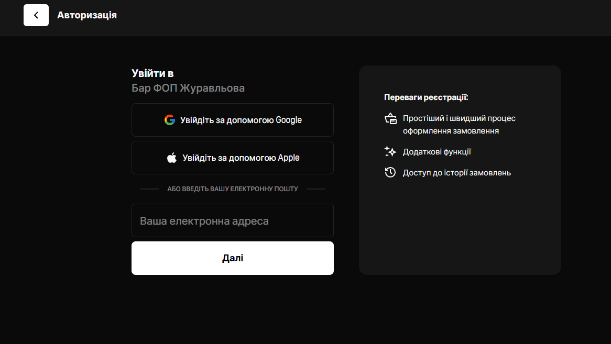
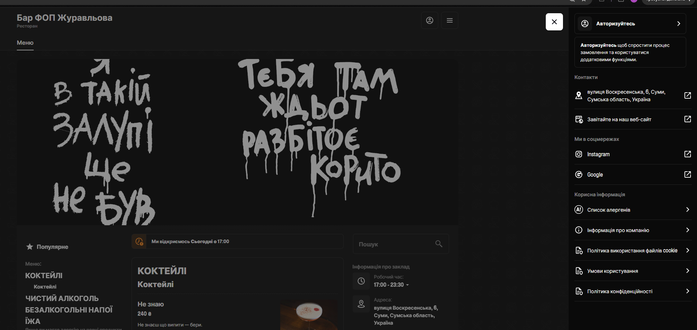
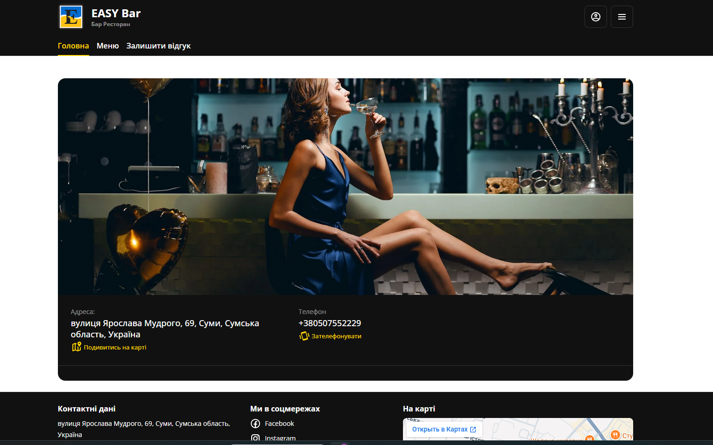

# Feature Specification: Сайт бара с меню и клиентским кабинетом

**Feature Branch**: `001-bar-menu-account`

**Created**: 2026-07-22

**Status**: Draft

**Input**: User description: "мне нужно сделать сайт для бара в котором будет меню, в меню будут напитки - алкогольные, без алкогольные, горячие, закуски, клиентский уголок в который смогут заходить гости после регистрации у нас на сайте, смотреть свои чеки, ознакамливаться с акциями и получать бонусы, так же будут наши контактные данные как с нами связаться, где мы находимся и краткое описание концепции заведения"

## Clarifications

### Session 2026-07-23

- Q: Нужны ли фотографии для позиций меню? → A: Да, у каждой позиции меню есть фотография.
- Q: Нужны ли у напитков доп. атрибуты — объём и крепость? → A: Да — для алкогольных напитков указывается крепость (%) и объём; для остальных напитков — объём.
- Q: Как показывать позицию, которая временно закончилась (стоп-лист)? → A: Отдельной механики «стоп-лист» не предусмотрено — все отображаемые в меню позиции считаются доступными.
- Q: Может ли одна позиция меню иметь несколько вариантов объёма/цены (например, 0.3л / 0.5л)? → A: Нет — по референсу меню у каждой позиции одно значение объёма и одна цена.
- Q: Референс показывает структуру категорий «Коктейлі / Чистий алкоголь / Безалкогольні напої / Їжа» вместо исходных 4 плоских категорий — какую структуру использовать? → A: Взять структуру референса, адаптировав её под двухуровневую иерархию (см. FR-001), сохранив «Горячие напитки» и «Закуски» как подкатегории.
- Q: Нужна ли вложенность категорий (категория → подкатегория), как в референсе? → A: Да, два уровня.
- Q: Нужны ли лайки и раздел «Популярное» у позиций меню, как в референсе? → A: Да, добавить.
- Q: Нужен ли поиск по меню, как в референсе? → A: Да, добавить.
- Q: Как именно должны отображаться акции в хедере — один статичный баннер или что-то ещё? → A: Свайпаемое поле (карусель) в хедере — несколько баннеров, между которыми гость переключается свайпом; отдельной страницы/списка акций не будет.
- Q: Нужен ли в кабинете отдельный раздел с историей начислений/списаний бонусов, а не только текущий баланс? → A: Да, показывать историю операций.
- Q: Нужно ли показывать состав покупки (список позиций) в каждом чеке, или только дату и сумму? → A: Полный состав чека — список позиций, цена, итог.
- Q: Может ли гость редактировать свои данные (имя, email, телефон, пароль) в личном кабинете? → A: Да, полное редактирование. (Обновление 2026-07-23: пароля в системе больше нет, вход только через Telegram — редактируются имя/email/телефон.)
- Q: Бонусы можно потратить через сайт, или они только накопительные/информационные (списание офлайн в баре)? → A: Только накопление/просмотр, списание офлайн в заведении.
- Q: Где размещается блок с адресом/часами работы относительно меню? → A: В том же месте, что на референсе — постоянно видимый виджет рядом со страницей меню.
- Q: Часы работы — расписание по дням недели (с раскрывающимся списком) или один общий диапазон? → A: Один общий диапазон на все дни.
- Q: Нужен ли динамический статус «открыто сейчас» / «откроемся сегодня в...»? → A: Нет, часы работы отображаются статично.
- Q: Контакты — только ссылки на соцсети (как в референсе) или ещё и телефон? → A: Телефон и ссылки на соцсети вместе.
- Q: Где разместить краткое описание концепции заведения («о нас»)? → A: Отдельный блок на главной странице сайта.
- Q: Ссылки на адрес и соцсети — просто текст или кликабельные переходы? → A: Кликабельные: адрес ведёт на Google Карты с этим адресом, Instagram и Google — на соответствующие внешние профили.
- Q: Референс регистрации показывает вход через Google/Apple + email, без телефона и пароля на этом экране — меняем ли подход к регистрации (ранее решили email/телефон+пароль с SMS-восстановлением)? → A: Оставляем email/телефон+пароль основным способом, добавляем вход через Google/Apple как быструю альтернативу.
- Q: На ещё одном референсе есть пункт «Оставить отзыв» — добавляем такую функцию? → A: Нет, оставляем вне скоупа. Телефон делаем кликабельным (звонок), в футере добавляем встроенную карту с адресом (в дополнение к ссылке на Google Карты).
- Q: Язык интерфейса сайта? → A: Весь пользовательский интерфейс — на украинском языке (заведение находится в Украине). Валюта соответственно — гривна (₴, UAH), а не рубль.
- 2026-07-23: Q: Можно ли сделать регистрацию без Google/Apple, через вход по Telegram или Instagram? → A: Instagram-вход непрактичен (требует Meta App Review и бизнес-верификации). Google/Apple OAuth заменены полностью на Telegram Login Widget (HMAC-верификация без OAuth-адаптера, см. research.md п.4) — не добавляется как альтернатива, а именно заменяет Google/Apple.
- 2026-07-23: Q: Убрать регистрацию совсем, вход только через Telegram либо Instagram? → A: Instagram по-прежнему технически непрактичен (тот же Meta App Review), делаем сейчас только Telegram. Форма email/телефон+пароль, страница `/register` и восстановление пароля по SMS удалены полностью — единственный способ входа и регистрации теперь Telegram Login Widget, аккаунт создаётся автоматически при первом входе.

## Open Decisions Before Implementation

Следующие вопросы не меняют пользовательскую ценность, но без ответов на них нельзя однозначно спланировать бэкенд, интеграции и приёмочное тестирование. До их решения функциональность, затрагивающая вопрос, следует считать **не готовой к реализации**.

| Приоритет | Решение | Статус |
| --- | --- | --- |
| ~~Блокер~~ | Первая версия работает с демонстрационными данными или с реальными учётными записями, SMS, Telegram-входом? | ✅ Решено: демо-данные для POS, реальные аккаунты гостей (только Telegram Login Widget, без пароля и SMS) уже реализованы. |
| ~~Блокер~~ | Какая POS-система — источник чеков и бонусов? | ✅ Решено: POS-интеграция откладывается на будущее; чеки на этом этапе вносятся вручную через внутренний админ-инструмент. |
| ~~Блокер~~ | Правила программы лояльности: валюта, процент начисления? | ✅ Решено: гривна (₴, UAH), бонус = **3% от суммы чека**, ставка настраивается администратором (см. новый раздел «Административный инструмент» ниже). |
| Высокий | Нужны ли подтверждение email/телефона при регистрации и защита от частых попыток входа/SMS-кодов? | Открыто — для v1 реализовано только ограничение попыток ввода SMS-кода (5 попыток) и cooldown 60с на повторную отправку; подтверждение email/телефона не реализовано. |
| ~~Высокий~~ | Где администрация меняет меню, баннеры, контакты, часы работы, ставку бонусов? | ✅ Решено: минимальный внутренний административный инструмент (см. ниже) — пока только для ставки бонусов и ручного внесения чеков; меню/баннеры/контакты по-прежнему правятся напрямую в БД/сид-скриптах. |
| Высокий | Требуется ли отдельный раздел акций в личном кабинете? Сейчас User Story 2 упоминает такую страницу, а FR-008 исключает отдельную страницу/список акций и оставляет только карусель в хедере. | ✅ Решено ранее: только карусель в хедере, формулировка User Story 2 приведена в соответствие с FR-008. |
| Средний | Как ведёт себя виджет адреса и часов работы на мобильном экране? | ✅ Решено: адаптивная вёрстка, брейкпоинт 720px (виджет уходит под контент). |
| Средний | Какие локаль, валюта и форматы телефона/даты используются по умолчанию? | ✅ Решено: интерфейс на украинском (`uk-UA`), валюта — гривна (₴, UAH). |
| Средний | Нужны ли возрастное подтверждение для алкогольного меню, согласие на обработку персональных данных и ссылки на документы? | Открыто — не реализовано в v1. |

## Административный инструмент (внутренний, не для гостей)

Отдельный раздел `/admin`, доступен только пользователям с флагом администратора (`User.isAdmin`, выставляется вручную в БД — самостоятельной регистрации админов нет). Минимальный скоуп для v1:

- **Настройка ставки бонусов**: администратор задаёт процент начисления (по умолчанию 3%) в одном месте; применяется ко всем новым чекам.
- **Внесение чека вручную**: администратор/персонал находит гостя по номеру телефона, вводит состав и сумму покупки; система создаёт `Receipt` + `ReceiptItem` и автоматически начисляет бонус по текущей настроенной ставке (`BonusTransaction`).

Управление меню, баннерами акций и контактными данными сайта в админ-инструмент **не входит** — они по-прежнему правятся напрямую в БД/сид-скриптах (см. data-model.md), пока не появится отдельный запрос на их вынесение в интерфейс.

## Delivery Boundaries

- В первую версию не входят онлайн-заказ, бронирование столиков, онлайн-оплата и отзывы.
- Полноценный административный интерфейс (управление меню/баннерами/контактами) не входит в скоуп — реализован только минимальный инструмент для ставки бонусов и ручного внесения чеков (см. выше).
- Интеграция с конкретной POS-системой не считается определённой до выбора системы и протокола обмена; для демонстрационного режима должны быть явно подготовлены тестовые чеки, операции и меню.

## User Scenarios & Testing *(mandatory)*

### User Story 1 - Просмотр меню (Priority: P1)

Любой посетитель сайта (без регистрации) заходит на сайт бара и просматривает меню, разбитое по категориям и подкатегориям (алкогольные напитки — коктейли/чистый алкоголь, безалкогольные напитки — включая горячие напитки, еда — включая закуски), а также может искать позиции и смотреть популярные, чтобы решить, стоит ли прийти в заведение и что заказать.

**Why this priority**: Это основная причина, по которой человек вообще заходит на сайт бара. Без работающего меню сайт не приносит ценности ни гостю, ни бизнесу — это минимально жизнеспособный продукт.

**Independent Test**: Можно полностью протестировать, открыв сайт без входа в аккаунт, переключаясь между категориями меню и убеждаясь, что по каждой категории отображаются позиции с названием и ценой.

**Acceptance Scenarios**:

1. **Given** посетитель открыл главную страницу сайта, **When** он переходит в раздел «Меню», **Then** он видит категории верхнего уровня («Алкогольные напитки», «Безалкогольные напитки», «Еда») с доступными подкатегориями.
2. **Given** посетитель находится в разделе «Меню», **When** он выбирает конкретную категорию или подкатегорию, **Then** отображается список позиций этой (под)категории с фотографией, названием и ценой каждой позиции.
3. **Given** посетитель не зарегистрирован и не вошёл в аккаунт, **When** он просматривает меню, **Then** доступ к меню не требует регистрации или входа.
4. **Given** посетитель находится в разделе «Меню», **When** он вводит запрос в строку поиска, **Then** список позиций фильтруется по названию в реальном времени.
5. **Given** посетитель просматривает позицию меню, **When** он нажимает на лайк, **Then** счётчик лайков позиции увеличивается на 1, а повторное нажатие снимает лайк.
6. **Given** посетитель открыл раздел «Популярное», **When** страница загружается, **Then** отображаются позиции меню, отсортированные по количеству лайков.

---

### User Story 2 - Регистрация и личный кабинет гостя (Priority: P2)

Гость регистрируется на сайте, входит в свой аккаунт и в личном кабинете («клиентский уголок») просматривает историю своих чеков и накопленные бонусы; с текущими акциями он знакомится через карусель баннеров в хедере (FR-008), доступную на любой странице сайта, а не только в кабинете.

**Why this priority**: Это ключевая функция для удержания гостей и программы лояльности — превращает разовых посетителей в постоянных клиентов, но сайт остаётся полезным даже без неё (за счёт меню из User Story 1).

**Independent Test**: Можно полностью протестировать, зарегистрировав нового гостя, войдя под ним и убедившись, что в личном кабинете отображаются (пустая или заполненная) история чеков, список акций и баланс бонусов.

**Acceptance Scenarios**:

1. **Given** новый посетитель на сайте, **When** он заполняет форму регистрации корректными данными, **Then** для него создаётся аккаунт и он получает доступ в личный кабинет.
2. **Given** зарегистрированный гость ранее выходил из аккаунта, **When** он вводит верные учётные данные на странице входа, **Then** он попадает в свой личный кабинет.
3. **Given** гость авторизован в личном кабинете, **When** он открывает раздел «Мои чеки», **Then** отображается история его чеков (или сообщение об их отсутствии, если чеков ещё не было).
4. **Given** гость находится на сайте (в том числе в личном кабинете), **When** страница загружается, **Then** в хедере отображается карусель с баннерами акций; гость может переключаться между баннерами свайпом (или стрелками), а состав баннеров меняется только вручную администрацией.
5. **Given** гость авторизован в личном кабинете, **When** он открывает раздел «Бонусы», **Then** отображается его текущий бонусный баланс.
6. **Given** неавторизованный посетитель, **When** он пытается открыть страницы личного кабинета (чеки, акции, бонусы), **Then** система перенаправляет его на страницу входа/регистрации.
7. **Given** гость авторизован в личном кабинете, **When** он открывает раздел «Бонусы», **Then** помимо текущего баланса отображается история начислений/списаний бонусов (дата, сумма, основание).
8. **Given** гость авторизован в личном кабинете, **When** он открывает конкретный чек, **Then** отображается полный состав покупки: список позиций, цена каждой и итоговая сумма.
9. **Given** гость авторизован в личном кабинете, **When** он переходит в раздел «Профиль» и изменяет свои данные (имя, email, телефон), **Then** изменения сохраняются и применяются при следующем входе.

---

### User Story 3 - Контакты, локация и о заведении (Priority: P3)

Посетитель сайта находит контактные данные бара (телефон и соцсети), адрес и часы работы — постоянно видимые рядом с меню, как на референсе, — а на главной странице знакомится с кратким описанием концепции заведения, чтобы понять, где находится бар и чем он привлекателен.

**Why this priority**: Важная, но вспомогательная информация — помогает посетителю принять решение прийти и найти заведение, но не является ежедневно используемой функцией, как меню или личный кабинет.

**Independent Test**: Можно полностью протестировать, открыв соответствующий раздел сайта и проверив, что там присутствуют контактные данные, адрес и текстовое описание концепции.

**Acceptance Scenarios**:

1. **Given** посетитель находится на странице меню, **When** страница загружается, **Then** в постоянно видимом виджете рядом с меню отображаются адрес заведения и часы работы (общий диапазон на все дни, без динамического статуса «открыто/закрыто»).
2. **Given** посетитель видит адрес заведения, **When** он нажимает на него, **Then** открывается Google Карты с этим адресом.
3. **Given** посетитель на сайте, **When** он ищет способ связаться с заведением, **Then** он видит номер телефона и кликабельные ссылки на Instagram и Google, каждая из которых открывает соответствующий внешний сервис.
4. **Given** посетитель на сайте, **When** он открывает главную страницу, **Then** он видит отдельный блок с кратким текстовым описанием концепции заведения.

---

### Edge Cases

- Если в категории меню пока нет ни одной позиции, раздел отображается пустым (без текста-заглушки и без ошибки).
- Если гость впервые заходит в личный кабинет, ему показывается приветственное поздравление; раздел «Мои чеки» при этом отображается пустым (чеков ещё нет).
- Если посетитель пытается зарегистрироваться с email или телефоном, которые уже используются существующим аккаунтом, система показывает ошибку «Пользователь уже зарегистрирован».
- Восстановление пароля выполняется через код, отправляемый по SMS на номер телефона, привязанный к аккаунту.
- Акции отображаются в виде свайпаемой карусели баннеров в хедере сайта; если активна всего одна акция, свайп/переключение недоступно. Автоматического скрытия по дате окончания нет — баннеры добавляются, убираются или переставляются только вручную администрацией.
- Если бонусный баланс гостя равен нулю, в личном кабинете отображается баланс в валюте со значением 0 (например, «0 ₴»), без отдельных сообщений-заглушек.
- Если поиск по меню не находит совпадений, отображается пустой результат с сообщением «Ничего не найдено».
- Повторное нажатие на лайк снимает его (переключение лайк/не лайк), а не увеличивает счётчик повторно.
- Если раздел «Популярное» пуст (ни у одной позиции ещё нет лайков), раздел отображается пустым, без ошибки.
- При попытке изменить в профиле email или телефон на уже используемый другим аккаунтом система показывает ту же ошибку «Пользователь уже зарегистрирован».
- Смена пароля в профиле требует ввода текущего пароля для подтверждения.
- Если у гостя ещё не было ни одного начисления/списания бонусов, история операций отображается пустой.

## Requirements *(mandatory)*

### Functional Requirements

- **FR-001**: Система ДОЛЖНА отображать меню в виде двухуровневой структуры категорий: «Алкогольные напитки» (подкатегории «Коктейли» и «Чистый алкоголь»), «Безалкогольные напитки» (подкатегория «Горячие напитки», остальные безалкогольные позиции — без подкатегории), «Еда» (подкатегория «Закуски»).
- **FR-002**: Каждая позиция меню ДОЛЖНА отображать название, цену, фотографию и краткое описание; для алкогольных напитков дополнительно указывается крепость (%), для всех напитков — объём.
- **FR-003**: Просмотр меню ДОЛЖЕН быть доступен любому посетителю сайта без регистрации и входа в аккаунт.
- **FR-004**: Система ДОЛЖНА позволять регистрацию/вход нового посетителя исключительно через Telegram Login Widget; отдельной формы email/телефон/пароль нет, аккаунт создаётся автоматически при первом входе через Telegram.
- **FR-005**: Зарегистрированные пользователи ДОЛЖНЫ иметь возможность входить в свой аккаунт и выходить из него.
- **FR-006**: Личный кабинет ДОЛЖЕН быть доступен только авторизованным пользователям; неавторизованные посетители при попытке доступа перенаправляются на вход/регистрацию.
- **FR-007**: Авторизованные пользователи ДОЛЖНЫ иметь возможность просматривать историю своих чеков в личном кабинете, включая полный состав покупки (список позиций, цена каждой) и итоговую сумму по каждому чеку.
- **FR-008**: Сайт ДОЛЖЕН отображать акции в виде свайпаемой карусели баннеров в хедере страниц (без отдельной страницы/списка акций); гость переключается между баннерами свайпом или стрелками, а состав и порядок баннеров управляется вручную администрацией заведения.
- **FR-009**: Система ДОЛЖНА начислять и хранить бонусы для каждого зарегистрированного пользователя.
- **FR-010**: Авторизованные пользователи ДОЛЖНЫ иметь возможность просматривать свой текущий бонусный баланс в личном кабинете, отображаемый в валюте (например, «0 ₴», если бонусов нет), а также историю начислений/списаний бонусов (дата, сумма, основание).
- **FR-011**: Система ДОЛЖНА гарантировать, что пользователь видит только свои собственные чеки и бонусы, но не данные других пользователей.
- **FR-012**: Сайт ДОЛЖЕН отображать номер телефона (кликабельная ссылка вида «позвонить») и кликабельные ссылки на социальные сети/профили заведения (например, Instagram, Facebook, Google) как способы связи; переход по каждой ссылке открывает соответствующий внешний сервис.
- **FR-013**: Сайт ДОЛЖЕН отображать физический адрес заведения в постоянно видимом виджете рядом со страницей меню (как на референсе); адрес кликабелен и ведёт на Google Карты с этим адресом. В футере сайта ДОЛЖНА быть также встроенная карта (embed) с местоположением заведения.
- **FR-014**: Сайт ДОЛЖЕН содержать отдельный блок с кратким текстовым описанием концепции заведения на главной странице.
- **FR-015**: Если категория меню не содержит позиций, система ДОЛЖНА отображать раздел пустым, без сообщений об ошибке.
- **FR-016**: При первом входе гостя в личный кабинет система ДОЛЖНА показывать приветственное поздравление; раздел «Мои чеки» при этом отображается пустым.
- **FR-017**: Система ДОЛЖНА показывать ошибку «Пользователь уже зарегистрирован», если email или телефон, указанные при редактировании профиля, уже привязаны к другому существующему аккаунту.
- ~~FR-018~~: Восстановление пароля по SMS удалено вместе с паролем — входа без Telegram-аккаунта не существует, восстанавливать нечего.
- **FR-019**: Сайт ДОЛЖЕН предоставлять поиск по названию позиций меню с фильтрацией результатов по мере ввода запроса.
- **FR-020**: Система ДОЛЖНА позволять любому посетителю (без регистрации) ставить и снимать лайк у позиции меню; счётчик лайков виден всем посетителям сайта.
- **FR-021**: Сайт ДОЛЖЕН отображать отдельный раздел «Популярное» со списком позиций меню, отсортированных по количеству лайков.
- **FR-022**: Сайт ДОЛЖЕН отображать общее уведомление о необходимости предупреждать персонал об аллергии на продукты.
- **FR-023**: Сайт ДОЛЖЕН отображать часы работы заведения (единый диапазон на все дни, без динамического статуса «открыто/закрыто») в том же виджете, что и адрес (FR-013).
- **FR-024**: Авторизованные пользователи ДОЛЖНЫ иметь возможность редактировать данные своего профиля (имя, email, телефон) в личном кабинете. Пароля в системе нет — редактирование не требует его подтверждения.
- **FR-025**: Бонусы ДОЛЖНЫ быть только накопительными и информационными на сайте — списание/трата бонусов происходит офлайн в заведении, сайт не реализует онлайн-списание бонусов.
- **FR-026**: Если гость зарегистрировался через Telegram без указания номера телефона, система ДОЛЖНА запросить номер телефона отдельным шагом после первого входа — телефон необходим для привязки чеков.

### Key Entities

- **Пользователь (гость)**: зарегистрированный посетитель сайта; атрибуты — имя, контактные данные (email/телефон), учётные данные для входа, дата регистрации, текущий бонусный баланс.
- **Позиция меню**: атрибуты — название, категория и подкатегория (согласно двухуровневой структуре меню), цена, фотография, краткое описание, объём, крепость (только для алкогольных напитков), количество лайков.
- **Чек**: запись о покупке, связанная с аккаунтом пользователя; атрибуты — дата, состав покупки, итоговая сумма, начисленные бонусы.
- **Акция (баннер карусели)**: один из баннеров свайпаемой карусели в хедере сайта; атрибуты — заголовок/изображение, описание, порядок отображения; несколько акций могут быть активны одновременно, гость переключается между ними свайпом; набор баннеров формируется вручную администрацией, автоматического срока действия нет.
- **Бонусный баланс**: атрибуты — текущая сумма бонусов в валюте (0, если бонусов нет), история начислений/списаний, привязка к аккаунту пользователя.

## Success Criteria *(mandatory)*

### Measurable Outcomes

- **SC-001**: Новый посетитель может найти нужную категорию или подкатегорию меню (включая поиск по названию) не более чем за 10 секунд после открытия сайта.
- **SC-002**: Новый гость может пройти регистрацию на сайте менее чем за 2 минуты.
- **SC-003**: Авторизованный гость может увидеть свой последний чек и текущий бонусный баланс не более чем за 3 перехода/клика после входа в личный кабинет.
- **SC-004**: Не менее 90% посетителей находят контактные данные и адрес заведения на сайте, не прибегая к сторонним источникам.
- **SC-005**: Личный кабинет корректно работает при одновременном использовании как минимум 100 зарегистрированных пользователей без заметного снижения скорости отклика.

## Assumptions

- Регистрация и вход выполняются исключительно через Telegram Login Widget — форм email/телефон/пароль в системе нет; номер телефона запрашивается отдельным шагом после первого входа, так как он нужен для привязки чеков.
- Чеки попадают в личный кабинет гостя после того, как покупка в заведении связывается с его аккаунтом (например, по номеру телефона/карте лояльности, которые сотрудник указывает при оплате); интеграция с конкретной кассовой/POS-системой — вопрос последующего технического планирования, а не данной спецификации.
- Бонусы измеряются в валюте (например, в гривнах) и начисляются по факту покупок (например, в виде процента от суммы чека), накапливаясь на балансе аккаунта; точные правила начисления и списания уточняются на этапе планирования.
- Акции отображаются в виде свайпаемой карусели баннеров в хедере (может быть одна или несколько одновременно) и управляются вручную администрацией заведения — отдельного раздела/страницы со списком, архивом акций и датами действия не предусмотрено для первой версии.
- Отдельная механика «стоп-лист»/«нет в наличии» для позиций меню не предусмотрена — все отображаемые в меню позиции считаются доступными.
- У каждой позиции меню один объём и одна цена (без вариантов, например 0.3л/0.5л на одну позицию) — подтверждено референсом меню.
- Лайки доступны без регистрации; повторные лайки одного и того же посетителя ограничиваются на уровне браузера/сессии (например, через cookie), чтобы избежать искусственной накрутки счётчика.
- Общий текстовый дисклеймер об аллергиях («предупредите персонал о наличии аллергии на продукты») достаточен — отдельные поля аллергенов по каждой позиции меню не требуются для первой версии.
- Онлайн-заказ, бронирование столиков и онлайн-оплата не входят в объём данной функции — сайт на данном этапе только показывает меню и данные личного кабинета, но не принимает заказы.
- Ассортимент меню (конкретные позиции, цены) будет предоставлен и обновляться владельцем заведения; сама структура категорий фиксирована согласно описанию.
- Сайт ориентирован в первую очередь на десктопных и мобильных браузерных пользователей без отдельного мобильного приложения.
- Вход через Telegram — независимый способ входа, привязанный к `telegramId`; он не объединяется автоматически с существующим email/пароль-аккаунтом даже при совпадении имени, так как Telegram не предоставляет email.
